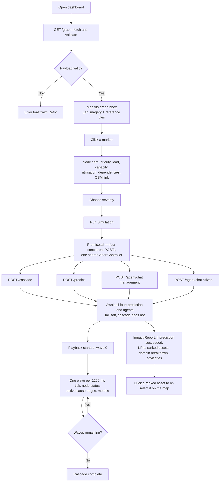
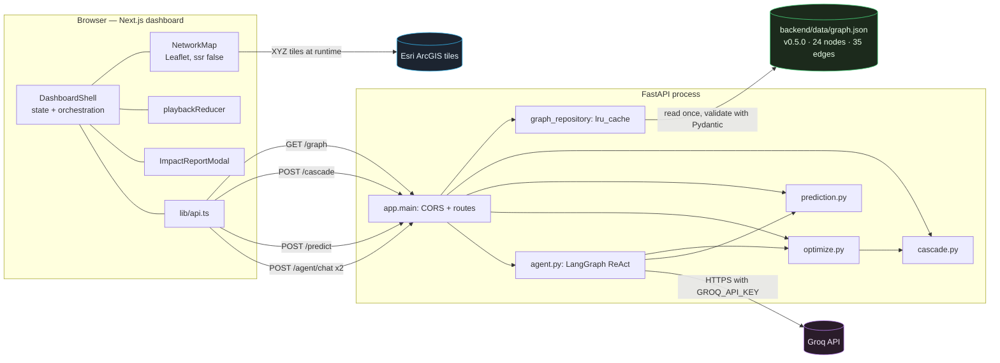
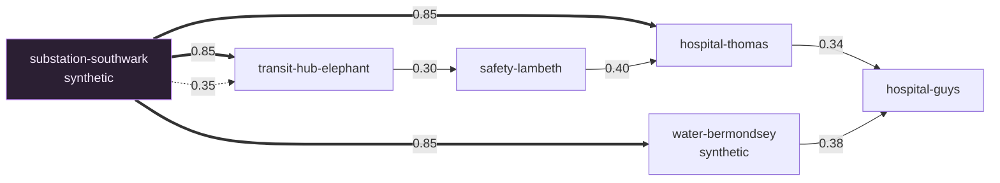
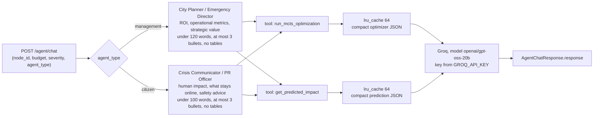

# ResiliNet

**Predict. Mitigate. Prevent the Cascade**

ResiliNet is an interactive infrastructure-resilience scenario sandbox. It models a curated set of
critical assets across five domains, lets you fail one of them on a live map, and shows how stress
propagates through declared dependencies — then reports the outcome analytically and in plain
language.

The demonstration geography is **Greater London**. Twenty of the twenty-four modelled assets are
real places, each carrying the exact OpenStreetMap element it came from. The other four are
explicitly synthetic. Every dependency edge between assets is **assumed** rather than
evidence-derived. Loads and capacities use illustrative NSU values; edge coefficients scale
transferred stress in hundreds of NSU, while `failure_probability` is an uncalibrated 0–1 score.

> ResiliNet is a scenario workbench for reasoning about cascading failure, not an operational system
> or validated forecasting tool. See [Limitations](#limitations) before quoting any number.

**Contents** · [Scope](#scope) · [Product flow](#product-flow) · [Architecture](#architecture) ·
[The graph](#the-graph) · [Cascade](#cascade-model) · [Prediction](#prediction-model) ·
[Optimizer](#optimizer) · [Agents](#advisory-agents) · [API](#api) · [Contracts](#data-contracts) ·
[Layout and stack](#repository-layout) · [Setup](#local-setup) · [Configuration](#configuration) ·
[Security](#security-and-data-boundaries) · [Scripts](#scripts) · [Testing](#testing-status) ·
[Limitations](#limitations)

---

## Scope

A single screen. A full-screen **Leaflet map** of central London over Esri satellite imagery shows
every modelled asset as a domain-coloured marker, with toggleable domain layers. **Clicking a marker**
opens a card with its domain, priority, illustrative load and capacity in NSU, utilisation, its
declared dependencies with edge weights, and a link to the real-world OpenStreetMap element where one
exists. You then pick a **severity** — `mild` (25%), `moderate` (55%) or `severe` (100%) disruption
injected at that asset — and press **Run Simulation**.

That one action fans out to four backend calls at once: the cascade, the impact prediction, and two
advisory reports. Playback waits for all four, then **plays the cascade wave by wave** on the map
with a live metrics strip (affected, failed, critical assets hit, priority-weighted damage, cascade
depth) and a per-wave causal explanation. Alongside it opens an **Impact Report**: KPIs, a ranked
list of at-risk assets, a per-domain breakdown, and two advisory tabs — a management briefing and a
citizen advisory.

Scenarios are computed on demand. There is **no durable scenario storage**: nothing you run is saved,
listed, or shareable, and restarting the backend clears every cached result.

| | |
| --- | --- |
| API / graph version | `resilicity-api` `0.2.0` · graph `0.5.0` |
| Graph inventory | **24 nodes, 35 dependency edges** — 20 OSM-backed, 4 synthetic |
| Domains | healthcare 7 · traffic 6 · power 4 · public_safety 4 · water 3 |
| Locality | Greater London, WGS84, bbox `51.45, -0.34 → 51.59, 0.01` |
| Edges | `dependency` only; **all 35 `assumed`** (28 low, 7 medium confidence), weights `0.25–0.85` |
| Model versions | cascade `demo-nsu-0.1.0` · optimizer `optimizer-0.1.0` |
| Storage | **None** — one read-only JSON file, no database |
| Frontend | Next.js 16.3.5 · React 19.3.0 · TypeScript 7.0.2 · Leaflet 1.9.4 · pnpm@11.19.0 |
| Backend | FastAPI 0.141.1 · NetworkX 3.6.1 · Pydantic 2.13.5 · Uvicorn 0.53.0 |
| Agents | LangChain 1.4.1 · LangGraph 1.2.11 · `langchain-groq` 1.1.3 |
| Agent model | `openai/gpt-oss-20b` via Groq — **hardcoded** in `app/agent.py` |
| Remote services | Esri ArcGIS tile servers (map) and Groq (advisories) |

---

## Product flow



The metrics strip offers replay/resume, pause, step forward and reset. The sidebar offers
replay/resume, pause and reset. Step forward is enabled while paused. Reset clears the run and hides
playback controls; it does not clear the selected asset.

## Architecture



`lib/api.ts` holds exactly four fetchers — `fetchGraph`, `runCascade`, `predictImpact` and
`runAgentChat` — so those four labelled arrows are the complete set of calls the browser makes.
`/health`, `/graph/topology` and `/optimize` are implemented and documented below but are not
requested by the UI. In particular the agents do **not** call `/optimize` over HTTP: they import
`optimize_impact` and `predict_impact` as in-process LangChain tools.

The graph is loaded once per process and cached (`get_graph()` and `get_network_graph()` are both
`@lru_cache(maxsize=1)`), so swapping the file needs a restart. The Pydantic model *is* the integrity
check: validation rejects duplicate ids, dangling or self-referencing edges, coordinates outside the
locality bounding box, and any node whose `base_load` is not strictly below its `capacity`. Every
route is read-only with respect to the graph.

---

## The graph

Thirty-five dependency edges is too many to draw legibly, so this is one connected six-node slice
drawn only to show the shapes involved: a high-weight power fan-out, a parallel pair into the same
target, and two routes that converge. Edge labels are the stored `weight` values.



Solid `==>` edges are `supplies power to` at weight `0.85` and `confidence: medium`; dotted is a
lower-weight `assumed_power_dependency`. Reading this slice:

- **`substation-southwark` supplies three shown assets through assumed 0.85-weight edges.** It also
  carries **two parallel edges into `transit-hub-elephant`** — the `0.85` power edge and a `0.35`
  dependency — and both count as inputs to the cascade, because the model sums over every matching
  edge rather than deduplicating by pair.
- **Two independent routes converge on `hospital-guys`**: the two-step chain
  `substation-southwark → hospital-thomas (0.85) → hospital-guys (0.34)`, and the two-step chain
  `substation-southwark → water-bermondsey (0.85) → hospital-guys (0.38)`. Convergence like this is
  what makes the deeper waves compound.
- **The paths through transit, emergency services and water converge on healthcare assets.** This is
  a selected subset, not the complete network.
- **The four synthetic assets** — `water-chelsea`, `water-bermondsey`,
  `water-monitoring-battersea`, `substation-southwark` — exist to give the demo a power and water
  topology. They carry `provenance.kind: "synthetic"`, `confidence: "low"` and `osm: null`. The other
  twenty are real OSM elements; their relationships are still assumed types such as hospital access
  and referral pathways, ambulance access routes, bridge runoff drainage and diverted demand.

The bundled graph has two weakly connected components and no isolated nodes. `GET /graph/topology`
reports the component count, isolate count and density computed live by NetworkX at request time —
read those values from the response rather than assuming them, since they depend on exact edge
directions.

---

## Cascade model

`POST /cascade` → `backend/app/cascade.py`, model version `demo-nsu-0.1.0`. Its docstring is blunt:
*"Small deterministic demonstration model; NSU values are illustrative."*

**Inputs.** `graph_version` (must match), `node_id` (must exist), `severity` (`mild` 0.25 /
`moderate` 0.55 / `severe` 1.0, default `severe`), `duration_steps` (1–12, default 6) and `seed`
(default `20260915`). **`duration_steps` does not affect propagation** — it is a scenario horizon
label, and the response's `assumptions[]` says exactly that. **`seed` is not used by this model** at
all, because the algorithm is already deterministic; the response does *not* flag that, and the three
`assumptions[]` strings concern illustrative NSU values, the horizon label, and dependency-only
transfer.

**Rules.** The engine iterates up to 13 synchronous waves, evaluating every node against the
*previous* wave's disruption values so nothing shortcuts within a step:

```text
ratio           = ( base_load + Σ 100 × weight × source_disruption ) / capacity
raw             = clamp( (ratio − 0.85) / 0.35 , 0 , 1 )
new_disruption  = max( previous_disruption , raw )
```

The formula applies to **non-root nodes only**. The selected node is the root: it is *held* at its
severity value (0.25 / 0.55 / 1.0) on every wave rather than recomputed from its own incoming edges,
which is why its event carries `load_ratio: null`, empty `cause_edge_ids` and the reason
*"selected … outage"*. Root-ness is decided by `node_id == request.node_id`, not by graph topology,
so a node that also has incoming dependencies still behaves as a root for that run.

`source_disruption` is the previous wave's value on the edge's source. Three consequences matter.
**The failure threshold is 120% of capacity**, because `(ratio − 0.85) / 0.35` only reaches `1.0` at
`ratio = 1.2`; anything at or below 85% contributes exactly zero, and nodes start between 22% and 82%
utilisation. State bands are `failed ≥ 1.0`, `degraded ≥ 0.5`, `stressed > 0`, else `normal`. And
**`truncated: true`** means the 13-wave cap was reached while events were still firing — not an
error, and surfaced in the UI as `Step cap reached`.

**Output.** `graph_version`, `model_version`, the echoed `input`, a flat ordered `events[]`, the
`truncated` flag, and three fixed `assumptions[]` strings. Each event carries a deterministic
`event_id` (`evt-{step}-{index}`), its `step`, `node_id`, `causal_event_ids`, `cause_edge_ids`, the
previous and new state and disruption, the computed `load_ratio` (`null` for the injected node), and
a human-readable `reason`. The `cause_edge_ids` drive the map: exactly those edges turn red for the
duration of that wave.

---

## Prediction model

`POST /predict` → `backend/app/prediction.py`. The module docstring calls it a *"Predictive
vulnerability and failure risk engine based on graph topology and dependency physics"* and points at a
design document that is not in the repository (`.gitignore` excludes `docs/`).

**It is a hand-written heuristic, not a trained model, and it does not replay the cascade.** It has
no weights file, no training code, and no shared state with `cascade.py`, so the two endpoints can
legitimately disagree about the same scenario. The `Model: M3-NSU-Probabilistic-0.2` caption in the
report modal is a hardcoded display string with no backend counterpart.

For each node downstream of the failed asset:

```text
sev_mult   = mild 0.35 | moderate 0.65 | severe 1.0
weight     = Σ incoming dependency edge weights   (0.35 fallback when a node has none)
hop_decay  = 1 / (1 + 0.65 × (hop − 1))
prob       = clamp( sev_mult × weight × (0.5 + 0.5 × base_load/capacity) × hop_decay , 0.08 , 0.98 )
```

The failed node is always `prob = 1.0` with disruption `100 × sev_mult`. Nodes are ranked by
`(failure_probability, priority_weight)` descending, and only those with `disruption_pct ≥ 15` are
kept as affected. Per-domain status is `critical ≥ 0.60`, `severe ≥ 0.40`, `moderate ≥ 0.20`, `low`
when a domain has any impacted asset, otherwise `nominal`. `blast_radius_km` is the largest haversine
distance to a reachable node, floored at `1.2 km`. The response also carries
`priority_weighted_risk_score` and `recommended_interventions`, derived from the top-ranked
protectable affected assets.

How to read it:

- **`failure_probability` is a shaped score, not a calibrated frequency.** It carries no statistical
  guarantee; use it for ordering, not for decisions. **`duration_steps` is accepted and never read**,
  and **hop counts ignore edge weights**, so a `0.25` edge costs the same hop as a `0.85` edge —
  weight re-enters only through the incoming-weight sum.
- **Reachability follows edge direction.** NetworkX shortest paths traverse successors, so the
  forecast covers downstream dependents only. Failing the pure sink `hospital-guys` reaches nothing
  beyond ground zero, while failing `substation-southwark` reaches much of the network — an asymmetry
  of the assumed edge set, not of the real city.
- **The executive summary is templated prose** ending in a mitigation claim computed from
  `min(85, sev_mult × 70 + 15)`. It has no validation behind it and must not be quoted as a result.
- **Domain averages divide by the domain's full node count**, not the affected count, so a domain
  with one affected asset of seven reads low by construction.

---

## Optimizer

`POST /optimize` → `backend/app/optimize.py`, model version `optimizer-0.1.0`. **No client calls this
route.** The browser never does, and neither do the agents: the LangChain tools import
`optimize_impact` and run it in-process. The HTTP route exists for direct use only.

**Model.** The budget is `0…3` protections. The action space is every `protectable` node except the
one that failed — in this graph all 24 nodes are protectable, so 23 candidates. Protecting a node
multiplies its `capacity` by **1.25** on a deep copy of the graph and re-simulates the whole cascade.
The objective is `priority_weighted_damage = Σ priority_weight × max disruption reached`, and the
reward for a protection set is `max(0, baseline_damage − mitigated_damage)`.

```mermaid
flowchart LR
    A["optimize_impact(graph, request)"] --> B["MCTSOptimizer init<br/>random.seed(request.seed)"]
    B --> C["Baseline cascade with no protections"]
    C --> D{"Budget greater than zero?"}
    D -->|No| E1["algorithm_used = no_action"]
    D -->|Yes| F["MCTS loop<br/>100 simulations, 3000 ms cap, both hardcoded"]
    F --> G["Selection: descend fully expanded nodes by UCT, c = 1.414"]
    G --> H["Expansion: take one untried protection action"]
    H --> I["Rollout: fill the budget with random legal actions"]
    I --> J["Reward from re-simulation, memoised per protection set"]
    J --> P["Backpropagation: increment visits by one and add reward to totals<br/>up every ancestor to the root"]
    P --> K{"Iterations AND time still remaining?"}
    K -->|Yes| G
    K -->|No| M["Return the most-visited action path from the root"]
    E1 --> N["Re-simulate the final set and build Protection records"]
    M --> N
    N --> O["Return objective, search stats, mitigated result, timing"]
```



**What "optimal" does not mean.** `algorithm_used` is `mcts` or `no_action` and never claims a proven
optimum. With 23 candidates and a budget of three, 100 iterations cannot enumerate the space, so the
result is good-so-far, and the returned path is the **most-visited** child chain from the root rather
than a full max-reward argument.

**Reproducibility.** The search calls `random.seed(request.seed)`, so a fixed seed replays the same
rollout and tie-breaking sequence — provided nothing else in the process consumes the same global
`random` stream in between. That is why the seed is necessary but not sufficient for a guarantee:
the RNG is process-global rather than per-search, concurrent requests interleave on it, and the
search also stops on wall-clock time. The simulation and time caps are per-search arguments
(`max_simulations`, `max_time_ms`), set to the constants 100 and 3000 ms at the call site; they are
not global counters shared across requests.

**Telemetry caveats.** `search_stats.cache_hits` is hardcoded to `0` because deduplication happens at
the dict level. `timing.baseline_ms` and `timing.verification_ms` are the constants `1`, and
`timing.total_ms` is `search_ms + 2` rather than a measured total — only `search_ms` is measured.
`termination_reason` is inferred purely from elapsed time (`timeout` at or above 3000 ms, otherwise
`mcts_complete`). `baseline_run_id` falls back to the literal `"baseline"` because cascade runs carry
no `run_id`, and `optimization_id` is `opt-{seed}-{unix_seconds}`, so it is stable only within a
second. `Protection.parameter` is always `capacity`: there is no routing, isolation or restoration
action in the model.

---

## Advisory agents

`POST /agent/chat` → `backend/app/agent.py`. Two LangGraph ReAct agents share one LLM client and the
same two tools; the agents and the client are cached per process via `@lru_cache(maxsize=1)`.



Worth knowing before relying on this path:

- **A Groq API key is required, and the model is hardcoded.** `get_llm()` reads
  `os.environ.get("GROQ_API_KEY")` and pins `openai/gpt-oss-20b` with provider `groq`; the `GROQ_MODEL`
  variable in `.env.example` is never read. Without a key the call fails, the report shows
  *"…unavailable. Was Groq API key set?"*, and there is **no offline template fallback** anywhere in
  the codebase.
- **Which tools run, and in what order, is the model's choice.** The prompts *suggest* checking the
  prediction before running the optimizer, but nothing enforces guidance: an agent may call both
  tools, one, or neither, in any order, and may repeat a call. Treat the tool arrows in the diagram
  above as the available paths, not a fixed execution sequence.
- **Advisory text is non-deterministic and unverified.** The same scenario can produce different
  prose, and the prompt's length limits and ban on tables are instructions to the model rather than
  validation — so a run is not reproducible end to end even though the cascade is.
- **Tool outputs are trimmed deliberately** to protect the context window; the raw `mitigated_result`
  events never reach the model.
- **The caches help only after a call completes.** The caching is on the internal helper functions
  `_run_mcts_optimization_cached` and `_get_predicted_impact_cached`, each `@lru_cache(maxsize=64)`,
  not on the public `@tool` wrappers. A repeated call with identical arguments returns the stored
  result instead of recomputing. That is genuinely useful for a report that asks twice. But
  `lru_cache` does not coordinate in-flight work: if the management and citizen requests arrive
  together and both miss the cache, both will compute — the search or prediction can run twice, and
  only later identical calls are served from the cache. The source comment describes the intended
  saving; do not read it as a guarantee that a scenario is optimised exactly once.
- **Agent failures are reported as HTTP 500**, because the route catches bare `Exception`: an unknown
  `node_id` reaching a tool raises `ValueError` and surfaces as a server error rather than a 400.
- **The renderer avoids raw HTML.** `AgentMarkdown.tsx` is dependency-free and builds React nodes
  directly for headings, lists, tables, bold and italic. It never uses `dangerouslySetInnerHTML`, so
  model output is only ever rendered as React text and elements rather than injected markup.

---

## API

Base URL `http://127.0.0.1:8000`. All routes live in `backend/app/main.py` and its late-imported
modules, and only `GET`, `POST` and `OPTIONS` are allowed by CORS.

| Method | Path | Purpose |
| --- | --- | --- |
| `GET` | `/health` | Service liveness plus API and graph versions |
| `GET` | `/graph` | The validated graph |
| `GET` | `/graph/topology` | Live NetworkX topology metrics |
| `POST` | `/cascade` | Deterministic cascade propagation |
| `POST` | `/predict` | Heuristic impact prediction |
| `POST` | `/optimize` | MCTS protection search |
| `POST` | `/agent/chat` | LLM advisory report |

FastAPI also serves interactive docs at `/docs`, `/redoc` and `/openapi.json` while the app is
running; the UI does not link to them.

`/health` returns `status`, `service: "resilicity-api"`, `api_version: "0.2.0"` and
`graph_version: "0.5.0"`. `/graph` returns the full contract described in the next section.
`/graph/topology` returns `graph_version`, an `engine` string built from the installed NetworkX
version, and live `nodes`, `edges`, `weakly_connected_components`, `strongly_connected_components`,
`isolates` and `density` values — read the component counts from the response rather than assuming
them, since they depend on exact edge directions.

Each endpoint has its own request model, so the three scenario routes are similar but not identical.
`/cascade` and `/optimize` take `CascadeRequest` and `OptimizationRequest` (the latter is
`CascadeRequest` plus `budget`); `/predict` takes a separate `PredictionRequest` that has **no `seed`
field**, so sending one is a validation error rather than an ignored key.

| Field | `/cascade` | `/predict` | `/optimize` | `/agent/chat` |
| --- | --- | --- | --- | --- |
| `graph_version` | required | required | required | — |
| `node_id` | required | required | required | required |
| `severity` | `mild`/`moderate`/`severe`, default `severe` | same | same | same |
| `duration_steps` | 1–12, default 6 | 1–12, default 6 | 1–12, default 6 | — |
| `seed` | 0–2147483647, default `20260915` | **absent** | 0–2147483647, default `20260915` | — |
| `budget` | — | — | 0–3, default 3 | required, no bounds declared |
| `agent_type` | — | — | — | required: `management`/`citizen` |

`/cascade` and `/optimize` reject a mismatched `graph_version` with HTTP 400. `/predict` requires the
field in its request schema but does not compare it to the loaded graph; its response uses the loaded
graph version. `duration_steps` does not change either engine's calculation.

Responses are typed by `response_model`, which validates and **filters** the returned payload to the
declared fields. Only `/predict` and `/agent/chat` and the three `GET` endpoints declare one;
`/cascade` and `/optimize` return plain `dict`s.

Errors: a graph-version mismatch returns `400` from `/cascade` and `/optimize`, an unknown `node_id`
returns `400` from `/cascade` and `/predict`, and agent failures return `500`.

With the backend running, PowerShell users should use `Invoke-RestMethod` rather than `curl.exe`: the
`\"` escaping that works in `bash` is not valid PowerShell, and the body would be mangled. Fetch the
version from the graph itself instead of hardcoding it. These commands follow the route definitions
and were not executed while writing this README.

```powershell
Invoke-RestMethod http://127.0.0.1:8000/health
Invoke-RestMethod http://127.0.0.1:8000/graph/topology

$graph = Invoke-RestMethod http://127.0.0.1:8000/graph
$body = @{
    graph_version  = $graph.graph_version
    node_id        = "substation-southwark"
    severity       = "severe"
    duration_steps = 6
    seed           = 20260915
} | ConvertTo-Json
Invoke-RestMethod -Method Post -Uri http://127.0.0.1:8000/cascade `
    -ContentType "application/json" -Body $body
```

On macOS or Linux the equivalent is `curl -s http://127.0.0.1:8000/health`, with the JSON body
wrapped in single quotes so the shell leaves it alone.

---

## Repository layout

```text
backend/
  app/       main.py (FastAPI app, CORS, 7 routes) · settings.py · models.py (contracts + validators)
             graph_repository.py (cached load + NetworkX view) · cascade.py · prediction.py
             optimize.py (MCTS) · agent.py (ReAct agents, 2 cached tools, Groq client)
  data/      graph.json — the graph: v0.5.0, 24 nodes, 35 edges
  tests/     test_health · test_graph · test_optimize · test_osm_context
  pyproject.toml (pytest config) · requirements.txt · requirements-dev.txt · requirements.lock
frontend/
  app/       layout.tsx · page.tsx · globals.css (tokens, map, bento, animation) · icon.svg
  components/ DashboardShell.tsx (orchestration, fan-out, playback) · NetworkMap.tsx (Leaflet)
             ImpactReportModal.tsx · AgentRunningView.tsx (scripted animation) · AgentMarkdown.tsx
  lib/       api.ts (fetchers) · types.ts (contracts) · playback.ts (wave reducer)
  public/data/ osm-context.geojson · southbank-context.geojson · osm-import-metadata.json
  AGENTS.md · next.config.ts · tsconfig.json · package.json · pnpm-lock.yaml · package-lock.json
```

Absent from the repository: a `LICENSE` file, a root `AGENTS.md`, any container definition or CI
workflow, and any linting, formatting or frontend test configuration.

**Frontend stack.** Next.js 16.3.5 App Router with a single route rendering the `DashboardShell`
client component and its children;
React 19.3.0 with `useReducer` for playback; TypeScript 7.0.2 under `strict` with a `@/*` path alias;
Leaflet 1.9.4 loaded through `next/dynamic` with `ssr: false` because it needs `window`; Esri World
Imagery plus a low-opacity reference layer for tiles; hand-written CSS in `globals.css` for design
tokens, domain colours and the bento grid; and an in-house markdown renderer instead of a
`react-markdown` dependency. There is no state library, data-fetching library, component library or
frontend test runner, and the dev script pins `--webpack` explicitly. `pnpm` is the declared package
manager, and an npm `package-lock.json` is also committed.

**Backend stack.** FastAPI on Uvicorn with CORS middleware; Pydantic for contracts and graph
validation; NetworkX for the `MultiDiGraph` view, shortest paths, connectivity and density; LangChain
and LangGraph with `langchain-groq` for the advisory agents; `python-dotenv` for environment loading;
and pytest with httpx for tests. Exact versions are in the table at the top.

---

## Local setup

There is no committed virtual environment, `node_modules` or `.env` file, and none of the commands
below were executed while writing this document. Two terminals are needed: one for the API and one
for the UI.

**Prerequisites.** Node.js **≥ 22.13** (Node 24 LTS suggested) because `pnpm@11.19.0` declares
`engines.node: ">=22.13"` ([registry metadata](https://registry.npmjs.org/pnpm/11.19.0)) — the
frontend package itself only asks for `>=20.9.0`, but the pinned package manager is the stricter
constraint. **Python 3.12 recommended**, which satisfies the pinned `networkx==3.6.1` dependency's
minimum of Python 3.11 ([PyPI metadata](https://pypi.org/project/networkx/3.6.1/)). A Groq API key is
optional and only needed for the advisory reports.

### 1. Clone and enter the repository

```powershell
git clone https://github.com/53rao/ResiliNet.git
cd ResiliNet
```

### 2. Backend, Windows PowerShell

`pnpm` is not required for the backend. Run this from the repository root:

```powershell
cd backend
python -m venv .venv
.\.venv\Scripts\Activate.ps1
python -m pip install -r requirements-dev.txt   # requirements.txt alone omits pytest and httpx
Copy-Item .env.example .env                      # first time only — see the note below
python -m uvicorn app.main:app --reload --port 8000 --env-file .env
```

On macOS or Linux use `python3 -m venv .venv`, `source .venv/bin/activate` and
`cp .env.example .env`. Confirm liveness at `http://127.0.0.1:8000/health`.

> **Never overwrite an existing `.env`.** The `Copy-Item`/`cp` step is for a first-time checkout only;
> re-running it on a configured machine would replace a real `GROQ_API_KEY` with the empty template
> value. If `backend/.env` already exists, edit it instead of copying.

> **Pass `--env-file .env`.** `app/main.py` builds the app and reads `ALLOWED_ORIGINS` through
> `settings.get_allowed_origins()` at import time, while `load_dotenv()` runs later, when `app.agent`
> is imported near the bottom of the module. A value that exists only in `backend/.env` is therefore
> not guaranteed to be visible when CORS is configured. Uvicorn's `--env-file`, or exporting the
> variable in the shell first, removes the ambiguity; without either you get the built-in defaults
> (`localhost` and `127.0.0.1` on ports 3000 and 3001), which suits the standard dev setup.
> `GRAPH_PATH` and `GROQ_API_KEY` are read lazily, so they are unaffected.

### 3. Frontend, in a second terminal from the repository root

The pinned package manager is declared but not vendored, so install it first — or invoke it ad hoc
with `npx`, which needs no global install:

```powershell
npm install --global pnpm@11.19.0     # or skip this and use the npx form below

cd frontend
pnpm install                          # npx pnpm@11.19.0 install
Copy-Item .env.example .env.local     # first time only; macOS/Linux: cp .env.example .env.local
pnpm dev                              # npx pnpm@11.19.0 dev
```

If `pnpm` is unavailable and you would rather not install it, `npm install` plus `npm run dev` works
against the committed `package-lock.json`; the three scripts behave identically.

Open `http://localhost:3000`. `NEXT_PUBLIC_API_BASE_URL` is inlined at build time, so changing it
means restarting the dev server or rebuilding. To enable the advisory reports, put
`GROQ_API_KEY=your_key_here` in `backend/.env` and restart uvicorn; without it, everything except the
two advisory panels still works.

**Confirm the wiring.** `/health` returns `"status": "ok"`; the map shows 24 markers and no error
toast; selecting a marker, choosing `Severe` and pressing `Run Simulation` opens the report and starts
playback; and devtools shows four concurrent POSTs to `http://127.0.0.1:8000` — `/cascade`,
`/predict` and two `/agent/chat`. If the map renders but no data loads, read the error toast: it shows
either the HTTP status or *"Graph API returned an invalid graph"* from the client-side shape
validator. If you move the frontend port, add its exact origin to `ALLOWED_ORIGINS` — comma-separated,
and a wildcard entry raises `RuntimeError` at startup.

---

## Configuration

| Variable | Where | Effect |
| --- | --- | --- |
| `ALLOWED_ORIGINS` | backend | Comma-separated exact origins for CORS; wildcard rejected; read at app import |
| `GRAPH_PATH` | backend | Alternate graph JSON path, resolved against `backend/`; read lazily on first request |
| `GROQ_API_KEY` | backend | Groq credentials, read lazily on first agent use |
| `GROQ_MODEL` | — | **Never read**; the model is hardcoded to `openai/gpt-oss-20b` |
| `REPORT_MODE` | — | **Never read**; a placeholder from an earlier milestone |
| `OPTIMIZER_MAX_SECONDS` | — | **Never read**; the cap is hardcoded to 3000 ms |
| `OPTIMIZER_MAX_ITERATIONS` | — | **Never read**; the cap is hardcoded to 100 |
| `NEXT_PUBLIC_API_BASE_URL` | frontend | Base URL for browser requests; defaults to `http://127.0.0.1:8000`; inlined at build time |

`backend/data/graph.json` is authoritative, but three other places describe the graph and can drift:
`backend/tests/test_graph.py` (which asserts a 72-node, 118-edge revision), the frontend import
manifest (same stale counts), and the `M3-NSU-Probabilistic-0.2` caption in the report modal. Update
them together when you replace the graph.

---

## Security and data boundaries

This is a local demonstration, and the boundary is worth stating plainly rather than leaving implied.

- **There is no authentication, no authorisation and no rate limiting anywhere.** Every route is open
  to anything that can reach the port, and `/optimize` and `/agent/chat` are as reachable as
  `/health`. Run the API on localhost, as the documented setup does.
- **CORS is not an access control.** `ALLOWED_ORIGINS` decides which browser origins may read
  responses; it does nothing to stop a direct HTTP client, and `allow_credentials` is `False`. Treat
  it as a development convenience, not a security boundary.
- **The Groq API key stays server-side.** `GROQ_API_KEY` is read from the backend environment and
  never sent to the browser — the frontend only knows `NEXT_PUBLIC_API_BASE_URL`.
- **Scenario prompts and these summaries are sent to a third party.** The management and citizen
  agents send the node id, severity, budget and trimmed tool output (damage figures, protected node
  ids, blast radius, domain breakdown) to Groq's API over HTTPS; do not use sensitive infrastructure
  data with this demo.
- **Nothing here is fit for operational or public-safety use.** The models are illustrative, the
  advisories are unverified generated prose, and there is no audit trail of who ran what.

**Licensing.**

- **Data attribution** is present and required: the graph declares OpenStreetMap contributors under
  `ODbL-1.0`, the bundled Overpass extracts carry the same attribution, and the map shows
  `© OpenStreetMap | © Esri` for the Esri tile layer.
- **No project code licence is declared in this checkout**; OSM data attribution does not license the
  project source.

---

## Scripts

Backend commands are direct invocations; `backend/pyproject.toml` configures pytest only
(`pythonpath = ["."]`, `testpaths = ["tests"]`, `addopts = "-q"`).

| Command | Purpose |
| --- | --- |
| `python -m uvicorn app.main:app --reload --port 8000 --env-file .env` | Dev server |
| `python -m pytest` | Run the backend suite |
| `python -m pytest tests/test_health.py -q` | Run one module |
| `pnpm dev` / `pnpm build` / `pnpm typecheck` | Next dev on port 3000 / production build / `tsc --noEmit` |

The frontend exposes exactly those three scripts — there is no `start`, `lint`, `test` or `format`
script. A production server would be run through Next's CLI rather than a declared script, and that
path has not been verified here.

### Testing status

Four pytest modules exist: `test_health.py` (health payload and CORS allow/deny), `test_graph.py`
(graph payload, integrity, provenance boundaries, CORS, topology), `test_optimize.py` (`MCTSNode`
basics, legal actions excluding the failed node, a non-worsening objective, zero budget, seed
reproducibility) and `test_osm_context.py` (the bundled 50 km context and import manifest invariants).

**The suite is not a reliable gate at this commit, and no test was run while writing this README.**
`test_graph.py` still encodes the previous graph revision: it asserts 72 nodes with a
`power 12 / water 12 / traffic 18 / healthcare 18 / public_safety 12` histogram, 118 edges, and node
and edge ids such as `hlth-hospital-01`, `pwr-control-02` and `trf-bridge-06` that no longer exist.
One assertion also treats `edge.provenance.source` as an object attribute, but `GraphEdge.provenance`
is a bare `ProvenanceKind` string, so that check raises `AttributeError`. Its claims that every node
is `kind: "observed"` and has a non-null `osm` are likewise false for the four synthetic assets.
`test_health.py` matches current versions, and `test_optimize.py` exercises generic MCTS behaviour
against a node id that does still exist. Until `test_graph.py` and the import manifest are reconciled
with graph `0.5.0`, do not attach a passing-tests badge or a CI status claim to this repository.

---

## Limitations

**Models and claims**

- The **prediction engine is a heuristic**, not a trained model, and never replays the cascade. Its
  `failure_probability` values are uncalibrated scores.
- **`duration_steps` never affects behaviour** in either the cascade or the prediction; it is a
  horizon label. **`seed` is unused by the cascade** (which is deterministic without it) and seeds
  Python's `random` in the optimizer only.
- The **optimizer never proves optimality** within its hardcoded 100-iteration, 3000 ms budget, and
  only `capacity` can be protected, by a fixed `+25%`.
- **Advisory text is LLM-generated and unverified**, so **runs are not reproducible end to end**: the
  cascade is deterministic, but the prose is not, and the optimizer's search is bounded by wall-clock
  time as well as by a global RNG.

**Data and infrastructure**

- **NSU load and capacity values are not measured MW, ML/day or vehicles/hour.** The cascade scales
  each edge coefficient by 100 NSU and source disruption; prediction scores are not calibrated
  real-world failure frequencies.
- **All 35 dependency edges are assumed**, nothing is evidence-derived, and no node or edge claims
  `high` confidence. **Four of the 24 assets are synthetic**, so cascades through
  `substation-southwark` or the water nodes are illustrative by construction.
- **No durable persistence**: there is no database and no scenario history, only in-process caches
  that a restart clears.
- **Two remote services are involved** — Esri tile servers for map imagery and Groq for the advisories
  — and there is no offline map and no offline advisory fallback.
- **Nothing is validated for deployment**: the repository contains no container, CI or hosting
  configuration.

### Known gaps

`test_graph.py` and the import manifest still describe a 72-node/118-edge graph. Four documented
environment variables (`GROQ_MODEL`, `REPORT_MODE`, `OPTIMIZER_MAX_SECONDS`,
`OPTIMIZER_MAX_ITERATIONS`) are never read. CORS configuration is read before `load_dotenv()` runs.
Optimizer telemetry is partly placeholder: `cache_hits` is hardcoded to `0`, `baseline_ms` and
`verification_ms` are constants, `total_ms` is `search_ms + 2`, and `termination_reason` is inferred
from elapsed time alone. `AgentChatRequest.budget` is an unbounded `int`, unlike the optimizer's
`0…3`, so an over-large budget reaches the agent prompt unchecked. The prediction's
`M3-NSU-Probabilistic-0.2` caption has no backend counterpart, and its summary's mitigation claim is
generated prose. `lib/types.ts` declares a `CascadeMetrics` interface that `/cascade` does not return
— the UI computes those five numbers client-side in `playback.ts` — and `NetworkMap`'s
`showDependencies` prop is passed but never destructured. Both `.geojson` context files ship in
`/public` and are never fetched at runtime. There are no frontend tests, no linting or formatting
config, and no `LICENSE` file.

Reasonable next steps, in dependency order: reconcile the stale tests and import manifest with graph
`0.5.0`; wire or delete the four unused environment variables; move `load_dotenv()` to the top of the
import path so `.env` is authoritative; make the optimizer caps configurable and replace its
placeholder telemetry with real measurements; and decide whether `/predict` is a documented
independent heuristic or should be replaced by a cascade-derived estimate.

### Documentation map

| Resource | Where |
| --- | --- |
| Graph contract and validation | `backend/app/models.py` |
| Cascade rules and assumptions | `backend/app/cascade.py` |
| Prediction formulas | `backend/app/prediction.py` |
| Optimizer behaviour | `backend/app/optimize.py` |
| Agent prompts and tool contracts | `backend/app/agent.py` |
| Routes and CORS | `backend/app/main.py` |
| Frontend API wrappers and types | `frontend/lib/api.ts`, `frontend/lib/types.ts` |
| Playback semantics | `frontend/lib/playback.ts` |
| Frontend contribution rules | `frontend/AGENTS.md` |
| OSM import queries and provenance | `frontend/public/data/osm-import-metadata.json` |
